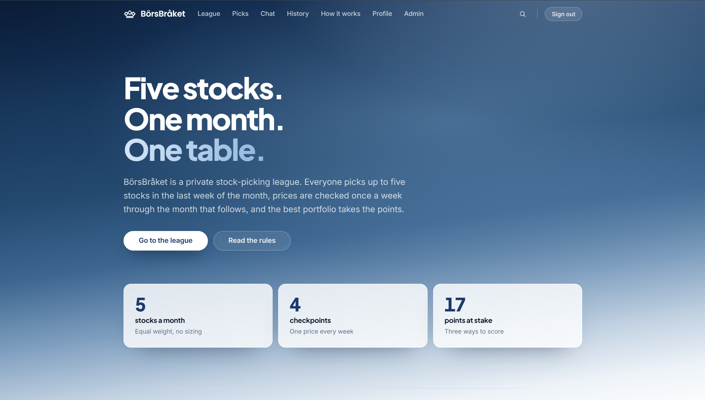

<div align="center">

# BörsBråket

**A private monthly stock-picking league.**
Five stocks, sealed until the month locks, scored against the other players.

[**borsbraket.vercel.app**](https://borsbraket.vercel.app) &nbsp;·&nbsp;
[The rules](https://borsbraket.vercel.app/instructions) &nbsp;·&nbsp;
[Setup](SETUP.md) &nbsp;·&nbsp;
[Status](STATUS.md)



</div>

---

## How a month works

Picking for a month happens in the **last week of the month before**. It opens on that month's
last Monday, seals on its last weekday, and the round then runs through the month itself to its
own last Monday — at which point the next month's picking week begins. One round's last day is the
next one's first.

| | |
|---|---|
| **Up to five stocks** | Equal weight, one entry per ticker |
| **Sealed** | Other players' picks are never sent to your browser while the month is open |
| **Baseline at the lock** | Not the 1st — see below |
| **Four checkpoints** | A price every seven days, and a last one when the month closes |

Measuring from the lock rather than the 1st is deliberate. If the baseline were the month's opening
price, whoever submitted last would have seen days of trading and could pick something that had
already moved. Sealing and measuring at the same instant gives everyone one starting price.

### Points

Three awards, and one player can take all three:

| | |
|---|---|
| **10** | The best portfolio of the month |
| **5** | Holding the month's best single stock |
| **2** | Finishing the month up |

Beating everyone always pays, even in a month where everyone is down: −1% against −2% is still the
best portfolio in the league. The single-stock award is the one with a floor — a stock that fell is
not the month's best call, however much less it fell than the rest. Down and beaten pays nothing.

There is no index to beat. The only thing you are measured against is what the other players
picked.

### Where you can pick from

Every Nordic list — Large, Mid and Small Cap and First North in Stockholm, Helsinki, Copenhagen and
Reykjavík, Spotlight and NGM's two markets beside them, Oslo Børs with Euronext Expand and Growth —
plus the main North American and UK markets, the large continental European venues (Xetra, Paris,
SIX, Amsterdam, Madrid, Milan), and Tokyo and Sydney.

The Nordic half is not maintained by hand. Each of those exchanges publishes its own current
listing, segment by segment, and `scripts/build-universe.mjs` takes it from them — so Mid Cap means
what Nasdaq says it means this year, and nothing is typed, matched or guessed at.

**Finding a stock** works two ways, and the difference is a read cost rather than a preference.
Choose a market and the picker loads that market, so the search box filters a list already in your
browser and matches anywhere in a name. Choose **All markets** and it loads nothing: what you type
goes to the server, which returns the handful of documents that match. That costs a few reads per
search instead of the whole universe per visit — which matters, because subscribing to the whole
`instruments` collection is the read that exhausted the daily quota once already. The trade is that
All markets matches the *beginning* of a name or ticker: "volvo" finds Volvo, "olvo" finds nothing.

## What's in it

| | |
|---|---|
| **League** | Season standings, compounded return, sortable on every column |
| **Picks** | Your picks, who has submitted, live returns once the month locks |
| **History** | Every settled month, each holding, and a record book |
| **Chat** | Rate-limited, and a posted message can never be edited, by anyone |
| **Players** | A profile and a season history for everyone in the league |
| **Admin** | Approvals, running the month, the price grid, the instrument universe |

## Built with

Next.js on Vercel, with Firebase Auth and Firestore behind it. TypeScript throughout. Prices are
fetched on a schedule and can always be entered by hand.

[`firestore.rules`](firestore.rules) is the access-control system — not the interface. The picks
seal, the approval gate, the rate limit on the board and the split that keeps email addresses off
public profiles are all enforced there, and the rules are tested against the Firestore emulator on
every push.

## Running it yourself

```bash
cp env.example .env.local   # fill in your Firebase project's values
npm install
npm run seed                # markets, instruments, league settings
npm run dev                 # http://localhost:3000
```

`env.example` explains which values are public and which are secret. [SETUP.md](SETUP.md) has the
full walkthrough — Firebase project, security rules, Vercel, and the price feed.

```bash
npm run typecheck    # tsc --noEmit
npm test             # the scoring functions
npm run test:rules   # firestore.rules against the emulator
npm run build
```

Refreshing the Nordic universe — worth doing when the exchanges reshuffle their segments, which
Nasdaq does once a year:

```bash
npm run universe              # ask the exchanges, report, change nothing
npm run universe -- --write   # rewrite lib/universe.generated.ts
npm run seed                  # and put it in Firestore
npm run seed -- --retire      # ...including retiring what is no longer listed
```

Read the report before writing. It names what moved between segments, what was renamed and what has
stopped being listed anywhere, which is the part worth a second of attention: a seed only ever adds,
so a company that changes segment leaves a document behind under the segment it left.

## A note on secrets

This repository is public, and deliberately contains nothing that needs to be private.

The `NEXT_PUBLIC_FIREBASE_*` values are safe to publish: a Firebase web API key identifies a project
and grants nothing on its own. What anyone may read or write is decided server-side by
[`firestore.rules`](firestore.rules).

The real secrets — the service account and the cron token — live in Vercel's environment variables
and in a git-ignored `.env.local`. No player data is in this repository: addresses, picks, messages
and results exist only in Firestore, and an unapproved account cannot read a single profile but its
own.

---

<div align="center">
<sub>Picking this up after a break? <a href="STATUS.md">STATUS.md</a> has the current state and the open questions.</sub>
</div>
